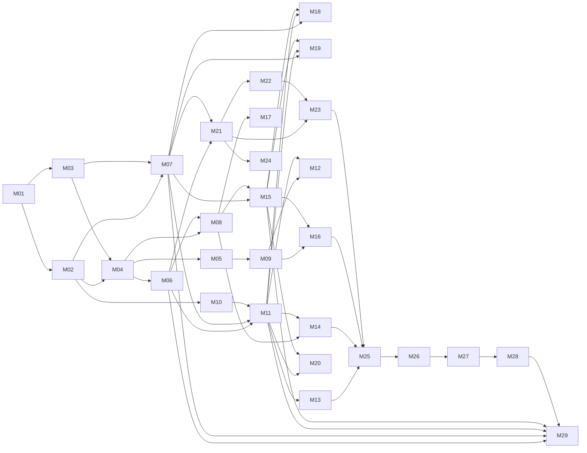

# Milestone 拆分表（28 個 + Phase 2 擴充）
**專案：Virtual Casino Sandbox｜版本 v1.1｜基準：一名全端工程師｜原估 35.5 人天**

> ✅ **M01–M28 已於 2026-06-12～2026-06-14 全部完成，v1.0.0 已發布**（詳見 `docs/PROJECT_STATE.md`
> 逐項完成紀錄）。實際耗時遠低於 35.5 人天估算——藉助 AI 協助生成 schema/型別/測試骨架，
> 多數 Milestone 壓縮至原估的數分之一。2026-06-16 補上聊天自動禁言等 M28 後續修補。
> **M29（2026-06-20）** 為 Phase 2「莊家 vs 閒家」新遊戲擴充第一批，編號延續本表但不計入
> 原 28 個 / 35.5 人天估算範圍，詳見 §2 末新增列。

---

## 0. 估算前提

- 「人天」= 一名熟悉本技術棧的全端工程師全心投入一日（含自測），不含等待確認時間。
- 每個 Milestone 完成定義（DoD）：專案可編譯可執行、相關測試通過、`PROJECT_STATE.md` 已更新、附建議 Commit Message。
- 開發順序遵循：**基礎設施 → 身份認證 → 基礎遊戲框架 → 具體遊戲邏輯 → 社交與經濟 → 管理後台 → 測試與部署**。
- 安全模組（M06）刻意排在所有遊戲邏輯之前——簽章/防重放是下注路徑的 preHandler 依賴，先建立才能避免後期回填改動所有路由。
- ✅ 實際開發未逐日核銷人天數字，而是以「完成內容敘述 + 測試結果 + DoD checklist」記錄於
  `docs/PROJECT_STATE.md`；本表人天估算保留作為規模參考，不代表實際耗用工時。

## 1. 階段總覽

| 階段 | Milestone | 小計人天 | 狀態 |
|---|---|---|---|
| A. 基礎設施 | M01–M03 | 3.5 | ✅ 完成（2026-06-12） |
| B. 身份認證與安全基座 | M04–M07 | 6.0 | ✅ 完成（2026-06-12） |
| C. 基礎遊戲框架 | M08–M09 | 2.0 | ✅ 完成（2026-06-12） |
| D. 老虎機 + Jackpot | M10–M14 | 7.0 | ✅ 完成（2026-06-12～13） |
| E. 輪盤 | M15–M16 | 3.5 | ✅ 完成（2026-06-13） |
| F. 社交與經濟 | M17–M20 | 4.0 | ✅ 完成（2026-06-12～13） |
| G. 管理後台 | M21–M24 | 5.5 | ✅ 完成（2026-06-13～14） |
| H. 部署、測試與發布 | M25–M28 | 4.0 | ✅ 完成（2026-06-14，v1.0.0 發布） |
| **合計** | **28 個** | **35.5** | **✅ 全部完成** |
| I. Phase 2／莊家 vs 閒家（擴充，未計入合計） | M29 | — | ✅ 完成（2026-06-20） |
| J. Phase 2／麻將單人先行版（擴充，未計入合計） | M30 | — | ✅ 完成（2026-07-03） |

## 2. 拆分表

| 編號 | 名稱 | 依賴項 | 人天 | 產出簡述 | 狀態 / 完成日期 |
|---|---|---|---|---|---|
| M01 | Monorepo 與開發環境啟動 | — | 1 | npm workspaces 骨架、`packages/shared` 空殼、`docker-compose.yml`（PG+Redis dev）、ESLint/Prettier/tsconfig strict、ESLint 禁用 `Math.random` 規則、`.env.example`、`PROJECT_STATE.md` 模板、README 快速啟動 | ✅ 2026-06-12 |
| M02 | Prisma Schema 與 Migration 基線 | M01 | 1.5 | 17 張表 schema 落地、首版 migration、raw SQL migration（物化視圖框架 + BRIN + jackpot 單行種子）、`seed.ts`（護符池 12 枚、任務池、成就、Admin 帳號）、dev SQLite / prod PG 雙 provider 驗證。備註：使用 Fable 5 生成可壓在 1.5 天；手動撰寫建議增至 2 天 | ✅ 2026-06-12 |
| M03 | Fastify 應用骨架 | M01 | 1 | `cluster.ts`/`server.ts`/`app.ts`、zod env 驗證（缺漏 fail loud）、prisma/redis plugins、AppError 階層與全域錯誤處理、pino 日誌、`/healthz` | ✅ 2026-06-12 |
| M04 | 認證模組 | M02, M03 | 2 | 註冊/登入（argon2id）、JWT 15m + Refresh 旋轉式（familyId 重用偵測全撤銷）、LoginLog 落庫、auth preHandler decorator、單元測試 | ✅ 2026-06-12 |
| M05 | API 與 Socket 事件規格凍結 | M04 | 1 | `docs/04_API_SPEC.md`：全部 REST 路由（方法/路徑/DTO/錯誤碼）+ Socket.IO 事件全表（payload 型別）；`packages/shared` dto/socket-events 同步建立（含完整型別對齊，使用 Fable 5 生成初版可壓 0.5 天） | ✅ 2026-06-12 |
| M06 | 安全基座（簽章/防重放/限流） | M04 | 2 | `security/csprng.ts` 唯一亂數出口、HMAC 金鑰登入協商 + Refresh 輪換（含 30s prev 寬限）、`hmac-guard` preHandler（timingSafeEqual）、nonce SET NX + seq Lua script、IllegalPacketLog 落庫、API 層令牌桶、單元測試（重放/竄改/過期向量） | ✅ 2026-06-12 |
| M07 | Wallet 模組（餘額唯一出入口） | M02, M03 | 1 | `debit()/credit()` 條件更新 + 行數檢查 + version 遞增、BalanceTransaction（before/after）同交易寫入、`scripts/audit-balance.ts` 對帳、併發競態整合測試（兩請求搶扣只成功一筆） | ✅ 2026-06-12 |
| M08 | Socket.IO 基座 | M04, M06 | 1 | redis-adapter 跨 worker、握手 JWT 驗證、200 連線上限拒絕、遊戲事件 HMAC 中介層（與 HTTP 共用 security/）、斷線重連語義 | ✅ 2026-06-12 |
| M09 | 玩家端前端骨架 | M05 | 1 | Vue3+Vite+Pinia+Router、`http.ts`（401→refresh 單次重試）、`sign.ts`（WebCrypto HMAC，key 僅記憶體）、socket 單例、登入/註冊頁、Lobby 殼、CoinDisplay | ✅ 2026-06-12 |
| M10 | 老虎機核心演算法 | M02 | 2 | 基礎權重表常數、`loadout-compiler.ts`（含 CONDITIONAL variants、幸運符號修正、loadoutHash）、`sampler.ts`（rngInt + 累積權重二分查找）、`payout.ts`（三連/二連/wild/pity/×1.5）— **純函式，單元測試覆蓋率最高的一包**；目標單元測試覆蓋率 >90%（sampler、payout、compiler） | ✅ 2026-06-12 |
| M11 | 老虎機 Spin 服務 | M06, M07, M10 | 1 | `POST /api/slot/spin` 全流程單交易：簽章驗證 → 條件扣款 → Redis 讀 CompiledLoadout（miss 重編譯）→ 抽樣 → 賠付 credit → BetRecord(serverSeedHash) → pity 計數；回應含完整盤面結果 | ✅ 2026-06-12 |
| M12 | 老虎機前端 | M09, M11 | 1.5 | ReelColumn 結果驅動動畫（減速停輪）、注額切換、PaytableModal、PityIndicator、餘額以伺服器回傳覆蓋、勝利特效 | ✅ 2026-06-12 |
| M13 | 護符系統 | M11 | 1 | 持有清單/裝備/卸下 API（槽位唯一約束）、裝備變更 → 重編譯 → Redis 覆寫、CharmSlotBar 前端、初版 12 枚護符效果落地驗證 | ✅ 2026-06-12 |
| M14 | 全服 Jackpot | M08, M11 | 1.5 | 下注 1% `INCRBY`、`jackpot-flush.job`（10s + txcount≥500，GETSET 取增量）、觸發判定（含 Diamond 點數修正）、派彩樂觀鎖交易（重試≤3、先強制 flush）、JackpotHistory、`jackpot:won` 全服廣播 + JackpotTicker 前端 | ✅ 2026-06-13 |
| M15 | 輪盤後端 | M07, M08 | 2 | 四階段狀態機（roundId、伺服器排程驅動；★實作合併進單一 `roulette.service.ts`，非規劃稿的 round-machine/bet-validator/settle 三檔）、注型驗證（含單注/總注上限、BETTING 時窗外拒絕）、`rngInt(37)` 開獎、批量結算單交易、熱門注型統計 → 聊天系統訊息、Redis leader lock 確保 cluster 單一狀態機 | ✅ 2026-06-13 |
| M16 | 輪盤前端 | M09, M15 | 1.5 | WheelCanvas 開獎動畫、BetBoard（紅黑/奇偶/大小/Column/Dozen/單號）、ChipSelector、PhaseTimer 同步、多人同場觀看渲染 | ✅ 2026-06-13 |
| M17 | 聊天室 | M08 | 1 | 收發事件、URL 過濾 + 轉義 + 200 字限制、令牌桶（1/2s、10/min）、Redis List 近 200 則（7 天 TTL）、ChatPanel 前端、系統訊息樣式；★自動禁言為 M28 後續修補才補上；DB 端定期清理 job 當時未落地，已於 **2026-06-20** 後續修補補上 `jobs/chat-cleanup.job.ts`（每日 04:30 Asia/Taipei 刪除超過 7 天的 ChatMessage，詳見 `docs/PROJECT_STATE.md`） | ✅ 2026-06-12 |
| M18 | 每日系統 | M07, M11, M15 | 1 | 登入獎勵（連續係數）、任務進度事件驅動累加 + 領取、今日幸運符號輪換、`daily.jobs.ts`（00:00 Asia/Taipei：重置 + loadout 快取 SCAN 批量失效）、DailyTaskDrawer 前端 | ✅ 2026-06-13＊ |
| M19 | 排行榜 | M07, M11, M15 | 1 | 三張物化視圖 raw SQL migration 完成、`leaderboard-refresh.job`（5m CONCURRENTLY）、每日 Top100 快照寫入、查詢 API + LeaderboardView | ✅ 2026-06-13＊ |
| M20 | 成就與個人頁 | M11, M15 | 1 | 12 個成就判定（事件驅動）、解鎖發幣 + 廣播、ProfileView（統計、護符圖鑑、歷史名次）；DIAMOND_TRIPLE/WILD_TRIPLE 當時僅定義未接線，已於 **2026-06-20** 後續修補補上（`slot.routes.ts` 三連判定區塊，與 LUCKY7_TRIPLE 同款 `reels[0] === 'DIAMOND'/'WILD'` 模式） | ✅ 2026-06-13 |
| M21 | 管理後台後端（核心） | M06, M07 | 2 | Admin 角色路由隔離、TOTP 綁定/驗證（secret AES-256-GCM、恢復碼）、登入強制 2FA、高危操作逐次重驗（code 防重用）、玩家查詢/封鎖/禁言、手動加扣幣（走 wallet + 審計）、AdminAuditLog 中介層 | ✅ 2026-06-13 |
| M22 | Gift Code 與紀錄查詢 | M21 | 1 | 建碼（≥16 字元 CSPRNG、必填時效）、兌換交易（條件更新 used_count + Redemption 唯一鍵雙保險）、登入/下注/交易三類分頁查詢 API、公告 CRUD | ✅ 2026-06-13 |
| M23 | 管理後台前端 | M21, M22 | 1.5 | 獨立 Vue app（/admin）：兩步登入、PlayersView（ReverifyDialog 攔截高危操作）、GiftCodeView（建碼僅顯示一次）、RecordsView、AnnouncementView、MonitorView | ✅ 2026-06-14 |
| M24 | 監控與異常偵測 | M21 | 1 | systeminformation 採集（CPU/RAM/溫度/磁碟）、線上人數/活躍房間、MonitorView 10s 輪詢、`anomaly.ts` 三規則（BET_RATE/WIN_RATE/NET_WIN_OUTLIER）→ flagged + 後台提示 | ✅ 2026-06-14 |
| M25 | 生產部署管線 | M14, M16, M23 | 1.5 | `docker-compose.arm64.yml`（mem_limit、healthcheck、依賴順序）、Nginx 全套（TLS 1.2+/HSTS/限流/80→443）、`gen-cert.sh`/`sysctl-hardening.sh`/`deploy.sh`/`backup.sh`/`restore.sh`、PG 參數（shared_buffers=256MB 等） | ✅ 2026-06-14 |
| M26 | RTP 模擬與負載測試 | M13, M25 | 1 | `simulate-rtp.ts` 蒙地卡羅 1,000 萬次（worker_threads 並行；空 Build 與典型 Build 各跑，驗證 90–94%）、k6 壓測（200 連線併發 spin + 輪盤滿房 + 混合場景） | ✅ 2026-06-14 |
| M27 | 整合測試與安全演練 | M26 | 1.5 | 整合測試：spin/輪盤/兌換全流程、雙花競態、Jackpot 並發派彩；`scripts/security-attacks/` 五類攻擊向量腳本（重放/seq 倒退/簽章竄改/逾時下注/聊天洗頻）— 全數被拒且落 IllegalPacketLog；覆蓋率報告（整體 Stmts 77.5%，安全模組 100%） | ✅ 2026-06-14 |
| M28 | 文件定稿與 v1.0 發布 | M27 | 0.5 | README 終稿、`docs/04_API_SPEC.md` 校訂（錯誤碼修正）、`PROJECT_STATE.md` 結算、需求對照表、打 tag `v1.0.0`；★2026-06-16 後續修補：聊天自動禁言/限時解除 + esbuild/ws/form-data CVE 修補 + `scripts/smoke-test.js` 部署冒煙腳本 | ✅ 2026-06-14（後續修補 06-16） |
| **M29** | **★莊家 vs 閒家新遊戲（射龍門/High-Low/Blackjack）** | M06, M07, M11, M15 | — | 沿用 Slot 已驗證模式（HTTP 同步 + 單一 Prisma 交易 + wallet + HMAC + 限流 + 異常偵測）；射龍門 `open`/`bet`（GETDEL 原子單步，含 Monte Carlo 抓出的賠率校準修正）、High-Low `deal/guess/continue/cash-out`、Blackjack `deal/hit/stand/double`（皆透過新增的 `security/round-lock.ts` 序列化）；新增 `jobs/abandoned-round.job.ts`（孤兒回合清理，明確不用 REFUND）、`shared/cards.ts`（標準撲克牌 + 洗牌）；`GameType` enum 純新增 3 值，**不新增任何 Prisma model**；新增測試 141 條（總計 531 條全綠）；射龍門已有完整前端，High-Low/Blackjack 前端與真實撲克牌圖片素材於後續 2 個 commit 補齊 | ✅ 2026-06-20 |
| **M30** | **★麻將聽牌挑戰（第三類「麻將」單人先行版）** | M06, M07, M29 | — | 麻將規則引擎（胡牌判定/聽牌/台數，未來多人麻將地基）+ 射龍門同款 open→bet 單步原子金流（GETDEL claim，無 round-lock/孤兒回合需求）；賠率逐手動態定價鎖定每手 EV=92%（換手重開無利可圖）；`GameType` 純新增 MAHJONG 列舉；同批修復管理後台紀錄查詢與 casino/farm 脫鉤（query schema 改 z.nativeEnum 派生 + admin 前端下拉由 shared enum 派生）；新增測試 58 條 | ✅ 2026-07-03 |

> ＊M18/M19 在 `docs/PROJECT_STATE.md` 並無獨立完成章節（僅見於需求對照表，標記 ✅），
> 日期依相鄰里程碑時序（M14/M16/M20 均為 2026-06-13）推估，非逐章節原文確認。

## 3. 依賴關係圖（關鍵路徑）

**關鍵路徑（已全數完成）**：M01 → M02 → M04 → M06 → M11 → M14 → M25 → M26 → M27 → M28（約 14.0 人天估算）；C/E/F/G 階段內多數工作已與關鍵路徑並行排程完成。**M29** 接續於 v1.0.0 發布之後，依賴 M06（HMAC/限流）/M07（wallet）/M11（Slot 服務模式）/M15（roulette leader lock → round-lock 同款前例），屬 Phase 2 第一批、不影響原關鍵路徑。

## 4. 風險緩衝建議

| 風險 | 對應 Milestone | 緩衝策略 | 實際結果 |
|---|---|---|---|
| Pi 實機效能不如預期 | M25/M26 | M25 提早做一次「空專案冒煙部署」（可併入 M03 後的半天驗證），避免最後才發現 arm64 映像或記憶體問題 | `scripts/smoke-test.js` 已備；Pi 4 真機最終冒煙測試仍待 arm64 硬體到貨（唯一未閉環項，見 `docs/PROJECT_STATE.md`） |
| RTP 模擬偏離區間 | M26 | 權重表集中在 `config/constants.ts` 單檔，調參不動程式邏輯；M10 即先跑小規模模擬 | 老虎機落在 91.5%；M29 射龍門 Monte Carlo **實際抓到** TIER_3 桶倍率「未加權平均」的校準錯誤（偏離目標 4pp+），已修正為加權平均後收斂 92%±4pp——驗證了此緩衝策略的價值 |
| 簽章機制前後端對不齊 | M06/M09 | M06 交付「簽章測試向量」（固定 key/payload → 期望 hex），M09 前端先過向量再接 API | 已落地，E2E（M27）以真實掛載 hmac-guard 驗證全鏈路 |
| Refresh/HMAC 輪換競態 | M04/M06 | 整合測試覆蓋「refresh 進行中發出舊簽章請求」場景（prev key 30s 寬限驗證） | 已落地並有測試覆蓋 |
| ★新遊戲規則需與外部規格對齊（M29 新增風險） | M29 | 規則邏輯與使用者自己的 `Underiger/pokergame`（High-Low/Blackjack 規則來源）逐行對應移植，而非重新設計，降低規則理解落差風險 | 多步驟回合的併發/孤兒回合處理為本專案原創設計（pokergame 為單機 CLI 無此問題），額外設計 RoundLock + abandoned-round job 因應 |

---
*每完成一個 Milestone：說明完成內容 → 列出新增/修改檔案 → 下一目標 → 更新進度與 `PROJECT_STATE.md` → 停下等待確認。M01–M28 已全數完成並發布 v1.0.0；M29 起為 Phase 2 擴充編號延續（不再計入 28/35.5 人天估算基準）。*
